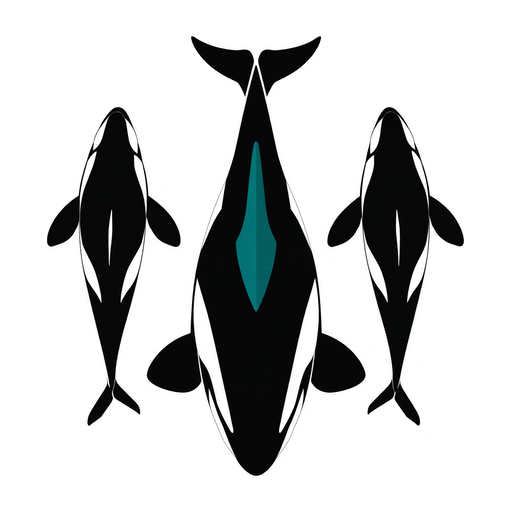

<p align="center">
  
</p>

<h1 align="center">Orka</h1>

<p align="center">
  <b>Make your best coding agent the CTO. Let cheaper agent CLIs do the work.</b><br>
  One agent plans, writes task cards, reviews and merges. Codex, Grok, Claude Code, Copilot, Cursor, Gemini or OpenCode workers<br>
  do the coding in parallel, each in its own git worktree. A different model reviews every critical change before it lands.
</p>

<p align="center">
  <a href="LICENSE"></a>
  
  
</p>

---

Your strongest agent is also your most expensive, and its context and quota run out first. Orka is an [Agent Skill](https://agentskills.io) plus a few hundred lines of bash that turn it into a **manager**. It talks with you, keeps the backlog and writes a task card for each piece of work. Headless coding-agent CLIs implement the cards, each in its own git worktree.

"Prompt + `git worktree`" is the easy part. What Orka adds are the rules that made it work on real projects:

- **A different model reviews every critical change** before merge.
- **The orchestrator re-runs the acceptance itself.** A worker's report is a claim, and an implementation card with `commits: 0` delivered nothing.
- **QA checks against your original words,** not the developer's checklist.
- **Every run is logged and scored,** so the next assignment is based on how each worker actually did.

These came from **217 worker runs (170 cards, 67 worker-hours)** on two private production projects, where Claude Code orchestrated Codex and Grok. The anonymized numbers are in [docs/evidence.md](docs/evidence.md).

A session, shortened (a *card* is one task file for one worker; `c03r` is the lead's review of card `c03`):

```text
you     › Use Orka. Fix the five registration-form bugs we just listed, then the payment page.
orka    › Team from .orka/orka.json: lead codex/astra · senior codex/sol · mid grok · junior codex/luna
          Wrote 3 cards. Predicted: c03 senior (hard point: old stored forms must still load) …
          Say "go" when the backlog is right.
you     › go
orka    › c03r (lead): REQUEST CHANGES, old stored forms vanish from the admin page.
          Fix list appended to c03, attempt 2 running. c04 accepted: build, tests, browser check OK.
          $ .orka/bin/orka status
          CARD                      STATE     TRY   RC    MIN  GIT  WORKER
          c03-registration-form     running     2    -     12    -
          c03r-review               done        1    0      2    0  codex/gpt-6-astra/high
          c04-payment-page          done        1    0     24    3  grok/grok-4.7/medium
          c03q-qa                   todo
```

## Why

- **Tokens and quota.** One strong model managing four cheaper ones gets through a lot more work before anything runs out. The orchestrator reads diffs and reports, not the whole codebase.
- **A second model finds what the author can't.** **15 of 16 first-round lead reviews came back REQUEST CHANGES**, each time for real problems that had got past the author's own passing tests: a data-loss regression, a session-replay window, a double-order race. The median review took about 4 minutes ([details](docs/evidence.md#first-round-lead-reviews)).
- **Parallel, isolated work.** Each card runs in its own git worktree and branch, with its own database, ports and browser session if you want them. Workers never step on each other or on your checkout.
- **A ledger instead of a gut feeling.** Every run gets a predicted and an actual score ([smart / dumb / speed / cost](#the-scores)) in `ledger.jsonl`. The skill tells the orchestrator to read the per-worker averages before it assigns the next card. Nothing is trained; it's a log the next session actually reads, and the orchestrator's own mistakes go into it too.

## How it works

```text
             you ──── talk, decide, say "go"
              │
      ┌───────▼────────┐   backlog.md · decisions.md · ledger.jsonl
      │  orchestrator  │   (Claude Code, Codex, Grok, Copilot, Gemini, OpenCode, Cursor …)
      │    = the CTO   │
      └───────┬────────┘
   card.md    │  .orka/bin/orka queue "c03-form senior" "c04-pay mid" …
      ┌───────┼──────────────────────┬─────────────────────┐
      ▼       ▼                      ▼                     ▼
   senior    mid                  junior                 lead
   worktree  worktree             QA in a headless      reviews the diff
   orka/c03  orka/c04             browser, screenshots  REQUEST CHANGES / APPROVE
      │       │                      │                     │
      └───────┴──── report.txt · meta.json (exit code, seconds, commits, usage) ─┘
                          │
              orchestrator re-runs the acceptance itself → merge → score → retro
```

Roles are abstract. **lead** reviews and judges; **senior** takes the hard cards and may split them into sub-cards for cheaper workers; **mid** does normal development; **junior** does research, browser, mobile and CLI QA, and simple fixes. You map each role to any CLI and model you have: four vendors, or one vendor at four price points (for example Opus / Sonnet / Haiku).

## Works with

**As the orchestrator:** any agent harness that can load an Agent Skill (`SKILL.md`) and run shell commands: Claude Code, Codex CLI, Grok CLI, GitHub Copilot CLI, Gemini CLI, OpenCode, Cursor, Amp and others. In harnesses without skill support, point the agent at `SKILL.md`.

**As workers:** each worker CLI is a small adapter in `.orka/bin/workers/<cli>.sh`.

| Worker CLI | Adapter | Verified end to end¹ |
|---|---|---|
| OpenAI Codex CLI | `codex.sh` | ✅ codex-cli 0.157 (200+ production runs) |
| Grok CLI | `grok.sh` | ✅ grok 1.0.41 (production runs) |
| Claude Code | `claude.sh` | ✅ 2.1.284 |
| Your orchestrator's own sub-agents (`"cli": "subagent"`) | built in | ⚠️ awaiting end-to-end orchestrator verification |
| GitHub Copilot CLI | `copilot.sh` | ✅ 1.0.88 |
| Cursor Agent CLI | `cursor-agent.sh` | ⚠️ flags checked against `--help`; not run (no login on the test machine) |
| Gemini CLI | `gemini.sh` | ⚠️ flags checked against `--help`; not run (no login on the test machine) |
| OpenCode | `opencode.sh` | ⚠️ flags checked against `--help`; not run (no provider on the test machine) |
| Anything else | [~10 lines](#add-a-worker-cli) | |

¹ A real worker received a card, edited a file in its worktree, committed it and returned its report. Tried one on the ⚠️ ones? A PR that flips it to ✅ is very welcome.

## Install

> **Before you install:** workers run headless with their CLI's approval prompts turned off, as your user, with your credentials. A worktree keeps them from colliding; it is not a sandbox. Use a container or VM on machines that matter. [More](#safety-read-this)

Pick **one**:

```bash
# Every harness on this machine: installs to ~/.agents/skills/orka, links it for Claude Code (and Cursor, if installed)
curl -fsSL https://raw.githubusercontent.com/ugorur/orka/master/install.sh | bash
```

```text
# Claude Code plugin
/plugin marketplace add ugorur/orka
/plugin install orka@orka
```

```bash
# With the skills CLI (asks which agents to install for)
npx skills add ugorur/orka
```

```bash
# Or by hand: copy skills/orka to wherever your harness reads skills
git clone https://github.com/ugorur/orka && cp -R orka/skills/orka ~/.agents/skills/
```

Install at **user** scope, not inside your project. A copy inside the repo would be checked out into every worker's worktree.

Runtime needs `bash`, `git`, `jq` and `timeout` (on macOS: `brew install coreutils jq`), plus the worker CLIs you want, each logged in once interactively.

## Quick start

In a git project, tell your agent:

> Use Orka. Let's plan the next piece of work.

1. **Bootstrap.** It runs `init.sh`, sees which CLIs are installed, proposes a team and asks you once. Your answer goes to `.orka/orka.json`. Model ids are whatever your CLI accepts; these are the ones we used in September 2026:

   ```json
   {
     "team": {
       "lead":   { "cli": "codex",  "model": "gpt-6-astra", "effort": "high" },
       "senior": { "cli": "codex",  "model": "gpt-5.6-sol", "effort": "high" },
       "mid":    { "cli": "grok",   "model": "grok-4.7",    "effort": "medium" },
       "junior": { "cli": "codex",  "model": "gpt-6-luna",  "effort": "medium" }
     },
     "parallel": 2,
     "timeoutMinutes": 120,
     "worktreeDir": "../myproject-wt",
     "autoMerge": false
   }
   ```

   **Smallest setup:** one CLI you already use, at different price points. In Claude Code on a subscription, all four roles can use `"cli": "subagent"`, with `opus` as lead, `sonnet` as senior and mid, and `haiku` as junior. Or use one headless CLI for every role. You can add other vendors later; a lead from a different vendor than the author gives the best reviews. Headless `claude -p` workers are for API-key or gateway setups.

2. **Talk.** Describe bugs and features the way you would to a team lead. They go into `.orka/backlog.md` in your words. Nothing runs yet.
3. **Say "go".** Cards are written, scores predicted, workers dispatched in parallel.
4. **Watch or sleep.** The orchestrator accepts each branch itself, gets critical ones reviewed by the lead, has the junior test the UI, merges (or asks first), scores everyone and reports back: what's merged, how it was verified, what is still open.

Everything lives in `.orka/` in your project, which is git-excluded and never committed:

```text
.orka/
  orka.json       the team            backlog.md    your requests, your words
  COMMON.md       rules on every card decisions.md  locked decisions + lessons
  tasks/          the cards           ledger.jsonl  every score, predicted vs actual
  runs/<card>/attempt-N/  prompt.md · report.txt · meta.json · logs
  env/<slot>.env  per-card ports/DBs  bin/          runner + worker adapters
```

## The commands

The orchestrator calls these; you rarely need to, but they are plain bash and easy to read.

| Command | What it does |
|---|---|
| `orka run <card> <role> [worktree]` | Run one card on the worker for that role; creates worktree + branch `orka/<card>` if needed |
| `orka run <card> <cli> <model> <effort> [worktree]` | Same, with a one-off worker |
| `orka finish <card> [exit-code]` | Finish a prepared native sub-agent attempt; use `--abandon` after a crash |
| `orka queue "<card> <role>" …` | Run many cards, at most `parallel` at once (no spaces in worktree paths) |
| `orka status` | Every card: todo · running · done · failed · timeout · stopped, minutes, commits, worker |
| `orka score <card> predicted\|actual …` | Log a score; `actual` also copies worker, time and usage (tokens / $) from the run |
| `orka score --summary` | Average scores per worker/model, which the orchestrator reads before assigning |

(`orka` = `.orka/bin/orka`.)

## The scores

For each worker run, the orchestrator records four numbers from 0 to 100: before the run what it **predicts** for the worker it picked, after the run what **actually** happened. A card that needed three attempts has three actual lines. The gap between the two is how it learns whom to give the next card.

| Score | Question it answers | Better | Example |
|---|---|---|---|
| **Smart** | Did the worker clear the card's *hard point*: the real root cause, everywhere it applies, honestly verified? | higher | 95: found the actual cause and proved it with a probe · 50: fixed the easy part, missed the risky part |
| **Dumb** | How silly was the **worst** mistake it made? One bad mistake is enough; it is not an average. | **lower** | 0: none · 30: tested against a hand-made object instead of real data · 80: faked a success or broke something unrelated |
| **Speed** | How fast was it for the size of the card? | higher | a 2-minute review scores high; 50 minutes for a small fix scores low |
| **Cost** | How cheap was it (tokens or dollars) for the value delivered? | higher | a $0.04 critique scores high; a $9 run for a one-line change scores low |

Smart and dumb are separate on purpose. A worker can crack a hard problem (smart 90) and still do something careless on the way (dumb 30). You want to know both before you hand it the next card.

```text
$ .orka/bin/orka score c03-registration-form predicted 85 10 50 45 "senior: contract → API → admin → mobile"
$ .orka/bin/orka score c03-registration-form actual    78 35 35 35 "legacy rows vanished; tests used a fake object twice"
  (each prints the ledger line it appended, as JSON)

$ .orka/bin/orka score --summary   # example from a longer ledger: averages of "actual" lines per worker
WORKER                   RUNS  SMART  DUMB  SPEED  COST  AVG_MIN
codex/gpt-6-astra/high   5     94     3     86     90    4
grok/grok-4.7/medium     2     87     7     86     92    3
codex/gpt-6-luna/medium  1     50     35    90     92    2
```

The scores are the orchestrator's honest judgement, not a benchmark. In the retro after each piece of work, independent reviewers (including the lead) score the orchestrator itself on the same scale, as `retro` lines.

## What 217 runs taught us

These are written into the skill as rules. Each one is here because we paid for it once:

1. **"Done" means the user's words, everywhere they apply.** When QA checked against the developers' own checklists, the owner's re-check found only about 10% of the items truly done. QA now checks against the original request.
2. **Author and reviewer must be different models.** It is the cheapest insurance in the whole setup.
3. **A worker's "done" is a claim.** The orchestrator re-runs the acceptance in the worktree. An implementation card with `commits: 0` delivered nothing, whatever the report says.
4. **Tests must use real data shapes.** One fix passed its unit test twice against a hand-made object and still failed on the real stored row. A junior's browser QA caught it.
5. **UI changed = seen in a headless browser.** A main button shipped broken (blocked by CSP) while every test was green.
6. **Isolate everything:** worktree, database, ports, cache index, browser session. Never the user's browser, never a shared container. Kill processes by PID only.
7. **Every card names its hard point.** Otherwise you get the easy 80% done and the risky 20% quietly skipped.
8. **Weak QA goes straight to the next level.** If the junior cannot run the checks, re-run the QA on mid immediately instead of retrying the junior.
9. **Research cards need web access,** or they will quote from memory as if they had fetched it.
10. **The orchestrator is scored too.** An independent reviewer and the lead grade it after each piece of work. In our runs its logged mistakes included a stdin hang, editing the runner while jobs were running, and a `pkill` that killed its own shell.

## Add a worker CLI

An adapter gets five environment variables and must leave the worker's final message in `report.txt`:

```bash
#!/usr/bin/env bash
# .orka/bin/workers/mycli.sh: ORKA_WT (worktree) ORKA_MODEL ORKA_EFFORT ORKA_PROMPT (file) ORKA_OUT (dir)
args=(--non-interactive --yes --cwd "$ORKA_WT")
[ -n "$ORKA_MODEL" ] && args+=(--model "$ORKA_MODEL")
mycli "${args[@]}" < "$ORKA_PROMPT" > "$ORKA_OUT/report.txt"
```

Then use `"cli": "mycli"` in `orka.json`. The runner handles the worktree, prompt assembly, timeout, secret masking in reports, `meta.json` and the ledger. Optionally write `$ORKA_OUT/usage.json` (for example `{"usd": 0.42}`) and it will show up in the ledger. Please send adapters upstream.

## Safety: read this

- **Workers run with approvals bypassed** (`--dangerously-bypass-approvals-and-sandbox`, `--always-approve`, `--dangerously-skip-permissions`, …). Nobody is there to click "allow" for a headless worker. They run as your user, with your credentials.
- **A git worktree is not a sandbox.** It keeps workers from colliding; it does not keep them out of the rest of your disk. On any machine that matters, run Orka inside a container or VM.
- Worker reports are pattern-masked for obvious secrets (`*_KEY=…`, `Bearer …`, `sk-…`, `ghp_…`) before the orchestrator reads them. This is a seatbelt, not DLP. Keep real secrets out of `.orka/env/`.
- Orka never pushes. Merging to your main branch asks you first unless you set `"autoMerge": true`.

## FAQ

**Can I use my harness's built-in sub-agents?** Yes. Set a role's CLI to `subagent`; Orka prepares its worktree and prompt, your orchestrator runs it, and `orka finish` records its report and ledger metadata. Native sub-agents usually share the orchestrator's vendor and quota, so separate CLIs still help when you want different quotas or blind spots.

**Do I need Claude Code?** No. Any harness that can read `SKILL.md` and run bash can be the orchestrator, and any CLI with an adapter can be a worker. Our production runs happened to use Claude Code → Codex + Grok.

**What does it cost?** Only what your worker CLIs cost. Real examples from the ledger: a lead review, 2–5 minutes and a few hundred thousand mostly-cached tokens; a senior feature card spanning contract → API → admin → mobile, 20–50+ minutes; a Grok mid card, $1.50–$9.35 (median $3.70). `orka score --summary` shows your own numbers.

**Is this a framework?** No. It's a skill (a markdown playbook) plus about 300 lines of bash. No daemon, no server, no database, no Node/Python runtime.

## Status

v0.1. The workflow was used on two private production repos (Claude Code orchestrating Codex and Grok). This public packaging is new. CI runs the plumbing tests on Linux and macOS (including the stock bash 3.2). Issues and PRs are welcome, especially adapters and ✅ verifications for more CLIs.

Run the plumbing tests with `bash tests/smoke.sh` (fake worker, no network, about a minute).

## License

[MIT](LICENSE) © Umurcan Gorur
